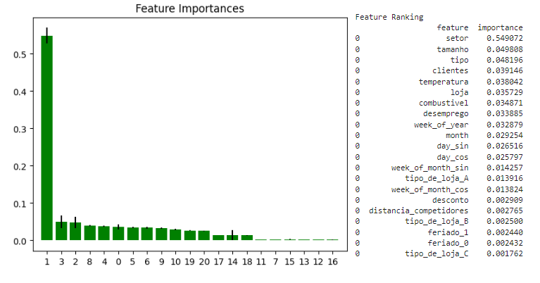

# Weekly Eletro Plaza Sales Forecasting

# Introdução

Este é um projeto end-to-end de Data Science de um modelo de regressão adaptada para séries temporais. E foi proposto como problema de negócio para o Hackday 7 da Comunidade DS.

O objetivo principal desse projeto é fazer a previsão das vendas semanais da última semana do ano da empresa Eletro Plaza, e como as últimas semanas do ano contém eventos como Black Friday e Natal, a métrica usada para rankear os melhores times na competição foi o RMSE, onde as 3 equipes com os menos valores do erro se classificavam para a final.

Este repositório contém a solução para o problema do Kaggle (criado especificamente para o Hackday 7) que o time utilizou para chegar no TOP 3 da competição e se classificar para a final: [https://www.kaggle.com/competitions/test-hackday-7/overview](https://www.kaggle.com/competitions/test-hackday-7/overview)

Esse projeto faz parte da "Comunidade DS", que é um ambiente de estudo que promove o aprendizado, execução, e discussão de projetos de Data Science.

### Plano de Desenvolvimento do Projeto de Data Science

Esse projeto foi desenvolvido seguindo o método CRISP-DS(Cross-Industry Standard Process - Data Science). Essa é uma metodologia capaz de transformar os dados da empresa em conhecimento e informações que auxiliam na tomada de decisão. A metodologia CRISP-DM define o ciclo de vida do projeto, dividindo-as nas seguintes etapas:

- Entendimento do Problema de Negócio
- Coleção dos Dados
- Limpeza de Dados
- Análise Exploratória dos Dados
- Preparação dos Dados
- Modelos de Machine Learning, Cross-Validation e Fine-Tuning.
- Avaliação dos Resultados do Modelo e Tradução para Negócio.
- Modelo em Produção

Nesse projeto em específico, como era voltado para a competição, o plano do time era fazer ciclos rápidos e gerar submissões para pontuar cada vez melhor na competição.

Dessa forma, os capítulos de Avaliação dos Resultados do Modelo e Tradução para Negócio e Modelo em Produção não foram realizados durante a competição, pois o intuito era treinar o modelo e gerar um RMSE menor que o baseline proposto.

### Planejamento

- [1. Descrição e Problema de Negócio](#1-descrição-e-problema-de-negócio)
- [2. Base de Dados e Premissas de Negócio](#2-base-de-dados-e-premissas-de-negócio)
- [3. Estratégia de Solução](#3-estratégia-de-solução)
- [4. Exploration Data Analysis](#4-exploration-data-analysis)
- [5. Seleção do Modelo de Machine Learning](#5-seleção-do-modelo-de-machine-learning)
- [6. Performance do Modelo](#6-performance-do-modelo)
- [7. Pontuação Final](#7-pontuação-final)
- [8. Conclusão](#8-conclusão)
- [9. Aprendizados e Trabalhos Futuros](#9-aprendizados-e-trabalhos-futuros)
- [10. Composição do Time](#10-composição-do-time)

# 1. Descrição e Problema de Negócio

### 1.1 Descrição

A EletroPlaza Store é um conglomerado de lojas presente em diversos países do mundo. Apesar da presença online da marca, as vendas são predominantemente físicas. A multinacional atua com eletrônicos, eletrodomésticos e acessórios em geral, oferecendo produtos acessíveis e de qualidade para uma vasta gama de clientes.

### 1.2 Problema de Negócio

Após diversos investimentos realizados nos setores de vendas, marketing e desenvolvimento de produtos, a empresa teve um grande salto em seu faturamento no último ano. Porém, junto ao faturamento, vieram novos desafios em tentar entender precisamente como as vendas vão continuar se comportando nas próximas semanas.

O ano está chegando ao fim e a Black Friday e o Natal estão se aproximando. As vendas tendem a subir exponencialmente ainda mais nessa época e os dados de comparação do ano passado já não servem mais como termômetro para a empresa. Além disso, a equipe de negócio tem uma meta de faturamento e está preocupada se conseguirá alcançá-la. A urgência em entender os possíveis resultados é grande.

O desafio da sua equipe, formada por cientistas e analistas de dados, é construir uma solução que preveja as vendas semanais das lojas e de seus variados setores para as 5 semanas finais do ano. Deste modo, os gestores da EletroPlaza Store poderão definir planos futuros, organizar estoques, calcular receitas, decidir se farão novos investimentos ou não e onde devem alocar estes novos investimentos, através de campanhas mais eficientes de marketing e vendas.

Os dados disponíveis para a previsão são referentes às vendas realizadas do início do ano vigente até o momento. Cada linha representa um setor específico de uma loja específica naquela determinada semana. São fornecidas diversas informações para análise, inclusive dados externos como temperatura, preço de combustível e taxa de desemprego. Ainda, devido a urgência da solicitação, há diversos dados faltantes na base e a sua equipe não tem tempo hábil o suficiente para coletá-los, devendo buscar soluções alternativas para que mesmo assim consiga realizar previsões eficazes.

**Após determinar os valores das vendas, a missão da sua equipe é enviar um arquivo .csv contendo os identificadores de cada registro e os respectivos valores de venda para a equipe de negócio.**

### 1.3 Expectativas

Os gestores da EletroPlaza Store esperam poder:

- Definir planos;
- Organizar estoques;
- Calcular receitas;
- Decidir se farão novos investimentos ou não;
- Decidir onde devem alocar estes novos investimentos, mediante campanhas mais eficientes de marketing e vendas.

### 1.4 Métrica de Avaliação

A métrica de performance proposta para esse desafio é a raiz quadrada do erro quadrático médio (RMSE), que nada mais é o desvio padrão dos valores residuais, conforme mostra a Equação 1:

  

As três equipes que alcançarem o menor RMSE largam em vantagem e passarão para a próxima etapa.

# 2. Base de Dados e Premissas de Negócio

## 2.1 Base de Dados

O conjunto de dados total possui os seguintes arquivos:

- stores.csv - características das lojas
- train.csv - dados de treino
- features.csv - atributos complementares
- test.csv - dados de teste
- sample_submission.csv - exemplo de submissão

Onde cada um apresenta as seguintes features:

**train.csv**

| **Feature**     | **Description**                             |
| --------------- | ------------------------------------------- |
| id              | identificador único do registro             |
| loja            | identificador único da loja                 |
| setor           | setor específico da loja                    |
| data            | semana (mês-dia) em que ocorreram as vendas |
| vendas_semanais | valor total das vendas semanais, em US$     |
| feriado         | se há feriado ou não na semana              |

**features.csv**

| **Feature**            | **Description**                                                                   |
| ---------------------- | --------------------------------------------------------------------------------- |
| loja                   | identificador único da loja                                                       |
| data                   | semana (mês-dia) em que ocorreram as vendas                                       |
| temperatura            | temperatura média da loja na semana, em °C                                        |
| combustivel            | preço médio do combustível na semana, em US$                                      |
| desconto_1             | desconto promocional especial do tipo 1                                           |
| desconto_2             | desconto promocional especial do tipo 2                                           |
| desconto_3             | desconto promocional especial do tipo 3                                           |
| desconto_4             | desconto promocional especial do tipo 4                                           |
| desconto_5             | desconto promocional especial do tipo 5                                           |
| desemprego             | taxa média de desemprego do país na semana                                        |
| feriado                | se há feriado ou não na semana                                                    |
| distancia_competidores | distância média entre as lojas competidoras, em polegadas                         |
| clientes               | quantidades de clientes presentes na loja, em média diária, durante aquela semana |

**stores.csv**

| **Feature** | **Description**                             |
| ----------- | ------------------------------------------- |
| loja        | identificador único da loja;                |
| tipo        | eletrônico, eletrodomésticos ou acessórios; |
| tamanho     | tamanho da loja, unidade não definida.      |

## 2.2 Premissas de Negócio

Para iniciar o projeto é necessário fazer uma junção (merge) dos 3 arquivos apresentados, dessa forma, criando um dataset único onde cada linha representa a venda semanal de um setor de uma loja específica, além de conter especificações da loja e informações complementares que podem ajudar e explicar a variável resposta como o preço do combustível na semana, a taxa de desemprego e principalmente o número de descontos.

# 3. Estratégia de Solução

A estratégia de solução foi a seguinte:

### Passo 01. Descrição dos Dados

Nesse passo foi verificado alguns aspectos do conjunto de dados, como: nome de colunas, dimensões, tipos de dados, checagem de dados faltantes (NA), análise descritiva dos dados e quais suas variáveis categóricas.

### Passo 02. Featuring Engineering

Na featuring engineering foi derivado novos atributos(colunas) baseados nas variáveis originais, possibilitando uma melhor descrição do fenômeno daquela variável.

As principais features criadas nessa etapa foram colunas derivando a data, como dia, mês, semana do mês e semana do ano, além de classificação da loja dependendo do seu tamanho e a soma dos descontos em apenas uma variável afim de diminuir a dimensionalidade do problema.

### Passo 03. Filtragem de Variáveis

Verificando a necessidade de filtrar o conjunto de dados com base em uma variável que não interessa ao projeto em si. Onde nesse projeto em questão nenhuma variável foi deixada de lado.

### Passo 04. Análise Exploratória dos Dados (EDA)

Exploração dos Dados com objetivo de encontrar Insights para o melhor entendimento do Negócio.
Foram feitas também análises univariadas, bivariadas e multivariadas, obtendo algumas propriedades estatísticas que as descrevem, e mais importante respondendo perguntas sobre o negócio.

Através dessa etapas conseguimos chegar em alguns pontos que nos ajudaram a fazer o modelo a performar melhor:

- **Excluir as linhas com vendas semanais nulas ou menores que 1**: Onde essas eram linhas que não conseguiríamos prover, pois se tratam de casos onde os setores das lojas não tiveram vendas, ou tiveram devoluções e estornos. Assim, esse comportamento poderia enviezar o modelo, dessa forma, preferimos excluir essas linhas do dataset.
- **Manter coluna dos descontos**: Haviam poucas semanas com desconto, e eram as últimas semanas do dataset, então no início pensamos em excluir essas colunas. Contudo, durante os eventos de Natal e Black Friday a estratégia dos descontos é muito utilizada para atrair e fidelizar clientes, assim, analisando o dataset de teste, vimos que várias linhas tinham dados de desconto. Decidimos então trabalhar com essa coluna e focar em ajudar ela a explicar o problema, visto que essa pode ser a feature que mais impacta no dataset de teste.

### Passo 05. Preparação dos Dados

Sessão que trata da preparação dos dados para que os algoritmos de Machine Learning possam ser aplicados. Foram realizados alguns tipos de escala e encoding para que as variáveis categóricas se tornassem numéricas.

### Passo 06. Seleção de Variáveis do Algoritmo

Na seleção dos atributos foi realizado um estudo de importância das colunas, no qual os atributos mais significativos foram selecionados para um estudo mais aprofundado com intuito de gerar melhor entendimento e criar features que explicam melhor a variável resposta. Não houve fitragem de variáveis por se tratar de uma competição.

### Passo 07. Modelo de Machine Learning

Realização do treinamento dos modelos de Machine Learning. O modelo que apresentou o menor RMSE diante a base de dados com cross-validation aplicada seguiu adiante para a hiper parametrização das variáveis daquele modelo, visando otimizar a generalização do modelo.

### Passo 08. Hyper Parameter Fine Tuning

Foi encontrado os melhores parâmetros que maximizavam o aprendizado do modelo. Esses parâmetros foram definidos com base no método de RandomSearch.

### Passo 9. Deploy do Modelo em Produção

Com o modelo e seus parâmetros escolhidos, o mesmo treinou a base completa dos dados (sem divisão de treino e teste) e foi usado para prever os valores para a submissão. Dessa forma, cada vez que um modelo era treinado e apresentava uma performance melhor (menor erro RMSE) o mesmo era usado para prever em cima dos dados de submissão e com isso o arquivo era enviado para o Kaggle.

### Passo 10. Apresentação Final

Como a equipe classificou-se para a final (ficamos no TOP 3), foi criado um slide com a explicação dos métodos utilizados para encontrar o menor erro.

# 4. Exploration Data Analysis

## 4.1 Análise Univariada

- Variáveis Numéricas: o histograma abaixo mostra como está organizada a distribuição das variáveis numéricas do nosso conjunto de dados. Mostra a contagem de cada variável numérica do dataset.

  

## 4.2 Análise Bivariada

Por ser um Hackday, nessa etapa gerados hipoteses para validar, entender melhor o negócio e criar features ou filtrar os dados para melhorar o RMSE.

### H1 - Semanas com mais desconto tem maiores vendas semanais

**VERDADEIRO** As semanas que apresentam descontos, apresentam também maiores vendas semanais.

- No primeiro gráfico podemos ver que a frequência das vendas tem um pico no início, mas mostra um grupo de outliers com valores mais altos.
- O mesmo acontece no segundo gráfico, onde vemos um grupo que se distancia bastante do terceiro quartil.
- Isso pode evidenciar exatamento as semanas que apresentam desconto, e com isso, tem um comportamento mais atípico quando comparado com os demais meses do ano, mostrando assim a importância dessa coluna para a previsão das vendas semanais das últimas semanas do ano.

### H5 - Junho é o mês com menor vendas semanais.

**FALSO** - O mês com a menor média de vendas semanais é Janeiro e com a melhor é Julho. (De Janeiro a Outubro)

- No gráfico podemos observar em vermelho as semanas do mês de Janeiro, evidenciando o mês com a menor média nas vendas semanais e o melhor mês em Julho.
- Dessa forma, é justo imaginar que os clientes não compram em janeiro por estarem guardando o dinheiro do começo do ano para constas como IPTU e IPVA, além disso, eles podem ter usado os bônus de fim de ano para comprar exatamente onde queremos prever, a Balck Friday e o Natal, mostrando a importância do estudo.

### H3 - Eletrodoméstico vende mais que Eletrônico.

**VERDADEIRO** - Eletrodomésticos apresentam vendas semanais maiores que eletrônicos.

- No gráfico observamos que os clientes tem preferência por comprar eletromésticos, sendo esse o tipo de produto que é a cara da EletroPlaza quando os clientes pensam na marca.

## 4.3 Análise Multivariada

Essa etapa mostra como cada coluna do dataset está relacionada entre si e nos gera ideias para criar features e testar.

  

Apesar da pouca correlação, através desse mapa de calor conseguimos destacar que algumas features apresentam as maiores relações com a nossa features preditiva:
- Tamanho da loja;
- Setor;
- Loja/tipo.

### 4.3.1 Features Importance

Além disso, foi gerado um Feature Importance para entender quais features um modelo de árvore mais usaria para prever a variável resposta.

  

Percebemos assim que a **magnitude das vendas semanais está extremamante relacionada ao seu setor**, e o tamanho e tipo ta loja também influenciam na previsão.

# 5. Seleção do Modelo de Machine Learning

Os seguintes algoritmos de Machine Learning foram aplicados:

- Linear Regressor;
- Linear Regressor - Lasso;
- Linear Regressor - Ridge;
- Linear Regressor - Elastic Net;
- K-NearestNeighbors Regressor;
- Random Forest Regressor;
- Light Gradient Boosting Machine Regressor;
- XGBoost Forest Regressor;
- Gradient Boosting Regressor;

O método de cross-validation foi utilizado em todos os modelos.

# 6. Performance do Modelo

Para medir o desempenho dos modelos, usaremos o método de validação cruzada que evita que o modelo seja superajustado quando o modelo recebe alguns dados que nunca viu antes (garantindo a generalização). 

A real performance dos modelos utilizando método CROSS-VALIDATION.

  

Como a competição nos instigava para encontrar o menor RMSE, essa foi a métrica que focamos melhorar. Assim, os modelos que apresentam o menor RMSE no Cross Validation foram:
- Random Forest Regressor;
- Light Gradient Boosting Machine Regressor;

Dessa forma, ambos os modelos passaram por um **HYPERPARAMETER FINE TUNING**, onde foram testados diversos pâmetros para esses modelos e os que apresentavam a melhor métrica após o  Cross Validation era usado para gerar o arquivo de submissão, segue abaixo um exemplo do quão perto os valores gerados foram.

  

# 7. Pontuação Final

Esse processo foi repetido durante os dois dias da competição. Ao criar uma nova feature ou gerar um novo Insight depois da Exploração dos Dados todo o modelo era treinado novamente e a métrica avaliada, caso o erro fosse menor que o da última submissão, uma nova tentativa era feita.

## 7.1 Tentativas

Assim, algumas ações foram feitas e testadas, segue abaixo o resultado prático:

| **Ação** | **Resultado** |
| ------------------------------------------- | ------------- |
| Excluir os registros com vendas semanais nula ou menor que 1 | Melhorou |
| Retirar os descontos        | Piorou |
| Preencher os registros com distância faltantes usando um número grande (sem concorrencia)| Estável|
| Criar colunas de dias e mês| Melhorou|
| Classificar as lojas pelo tamanho (grande, médio e pequeno)| Melhorou|
| Somar os descontos em uma coluna| Melhorou|

Assim, a ação que nos fez dar um salto na pontuação foi **Excluir os registros com vendas semanais nula ou menor que 1**.

## 7.2 Insights Acionáveis

Através do projeto e da análise alguns Insights Acionáveis foram criados:

**Janeiro apresenta a pior média de vendas semanal e julho a melhor.**
 - Com essa informação, podemos planejar promoções específicas ou lançamentos de produtos no mês de julho, visto que ele apresenta uma boa performance. Sobre janeiro, podemos identificar as campanhas e gerar estratégias de marketing como um saldão pós-ano novo para atrair os clientes e melhorar as vendas desse mês.

**Eletrodomésticos têm vendas superiores a eletrônicos e outros tipos de produtos.**
- Concentrar esforços de marketing e estoque em eletrodomésticos, talvez com promoções especiais ou pacotes que incluam esses produtos. Com isso, podemos ter um estoque adequado desses tipos de produto, visto que é o carro chefe da empresa e lidera nas vendas.

## 7.3 Ranking Final

A partir dessa construção e de todas as tentativas ficamos na terceira posição como o terceiro menor RMSE tanto no Leaderbord Público quanto Privado (que foi liberado apenas no final da competição):

  

E com esse resultado nos classificamos para a final, que ocorreu 3 dias depois, onde apresentamos o slide do link a seguir:

<a href="https://github.com/ian-alves-sousa/hackday_7_sales_prediction_regression/blob/main/Apresentação_%20Eletro%20Plaza%20Store.pdf" target="_blank">Apresentação Final</a>

O contexto do Grinch é que as duas outras equipes que se classificaram para a final tinham nome relacionado ao Natal, dessa forma, fomos para acabar com a comemoração.

# 8. Conclusão

Neste projeto, todas as etapas necessárias foram realizadas para implementar um projeto completo de Ciência de Dados em uma competição de dados. Foi utilizado o método de gerenciamento de projetos denominado CRISP-DM/DS e obteve-se a terceira menor métrica (RMSE) que levou a equipe para a final do Hackday 7 da Comunidade DS.

Tendo em vista esses resultados, o projeto alcançou seu objetivo de encontrar uma solução simples e assertiva para previsão de vendas semanais, realizando o projeto em apenas dois dias. E o principal foi melhorar 283% nesse meio tempo.

# 9. Aprendizados e Trabalhos Futuros

**Aprendizados**

- Esse problema de regressão no Hackday 7 teve um formato diferente, onde os dados estavam com muitos valores faltantes, e uma análise de dados bem feita seria crucial para conseguir os resultados. Isso nos mostrou a importância de entender o contexto do negócio e os dados para a construção do projeto.

- Assim, a Análise Exploratória de Dados se demonstrou uma das etapas mais importantes do projeto, pois é nessa parte que podemos encontrar Insights de Negócio que promovem novos conhecimentos e até contradições que nos fazem repensar o negócio como um tudo. E através dela que tivemos as ideias para filtragem e criação de features.

- Com pouco tempo para testes, uma boa organização supera a falta de conhecimento. Foi com uma boa divisão de tarefas que o time conseguiu concluir todas as etapas do projeto.

**Trabalhos Futuros**

- Criar novas features, afim de explicar com mais eficiência o os fenômenos do problema e consequentemente gerar resultados melhores.
- Testar diferentes Encoders na preperação dos dados.
- Aplicar o balanceamento dos dados e entender como isso influencia na resolução desse problema.
- Traduzir os valores dos erros em US$, contendo o melhor e o pior cenário por loja, para melhor visualização e análise do time de negócio;
- Aprofundar a compreensão do desempenho das lojas com base em seus tipos específicos de produtos, especialmente as lojas de eletrodomésticos. O objetivo é extrair insights que nos permitam otimizar a alocação de recursos, concentrando nossos esforços em áreas estratégicas que impulsionem o desempenho global da EletroPlaza Store.

# 10. Composição do Time

<a href="https://www.linkedin.com/in/christianods/" target="_blank">Christiano Bruneli Peres</a> 
<a href="https://www.linkedin.com/in/ian-alves-sousa/" target="_blank">Ian Alves Sousa</a> 
<a href="https://www.linkedin.com/in/paulawehdorn/" target="_blank">Paula Wehdorn Wildemberg</a> 
<a href="https://www.linkedin.com/in/victor-bongestab/" target="_blank">Victor Bongestab</a> 
<a href="https://www.linkedin.com/in/vinicius-gasperazzo-rosa/" target="_blank">Vinicius Gasperazzo Rosa</a>
